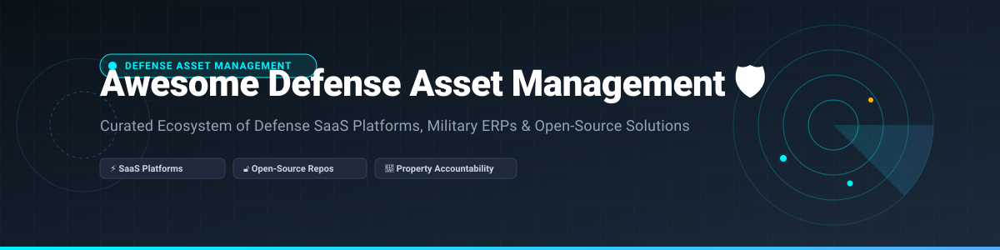

# Awesome Defense Asset Management 🛡️

  
  
  
  
  

## 📌 Ecosystem Overview & Defense Asset Management Solutions

A curated list of **SaaS products**, **Enterprise Resource Planning (ERP)** systems, and **Open-Source GitHub projects** for **Defense Asset Management**, **Military Property Accountability**, **Logistics**, and **Equipment Readiness**.

Defense asset management platforms handle military equipment tracking, maintenance workflows, property accountability (APSR), and government compliance across complex aerospace and defense assets.

---

## 💡 Market Insights & Industry Overview

> **Market Size & Structure**: The Global Defense Asset Management and Logistics Software Market is estimated at **$6.8 Billion USD in 2026** and is projected to reach **$10.5 Billion USD by 2031**. 
>
> **Market Fragmentation**: The market is **highly concentrated** among top tier defense software contractors and enterprise ERP leaders (e.g., SAP, Oracle, IBM, BAE Systems, IFS), driven by strict government compliance regulations (FAR/DFARS, DIACAP, FFMIA) and high security clearance requirements (SIPRNet/NIPRNet).

---

## 💼 SaaS & Enterprise Platforms

Below is a structured overview of top enterprise SaaS platforms serving military, defense, and public sector organizations, sorted by company revenue / market valuation in descending order.

| Platform / Product | Description & Use Case | Pricing Tier | Free Tier / Trial Limit | Valuation / Revenue |
| :--- | :--- | :--- | :--- | :--- |
| **[ServiceNow Public Sector](https://www.servicenow.com/)** 🏢 | Government service & IT asset management platform certified for public sector & defense workloads. | Starts at ~$100/user/month (Enterprise contract minimums apply) | **Free Developer Instance available** (hibernates after 10 idle days) | **$185B+ Valuation** ($10.9B Annual Revenue) |
| **[SAP Defense & Security](https://www.sap.com/)** 🛡️ | Comprehensive defense ERP and enterprise asset lifecycle tracking system. | Custom enterprise quotes (~$3,000+ per user/year) | **14-day Free Trial** for SAP Business Technology Platform | **$260B+ Valuation** ($34B Annual Revenue) |
| **[Oracle Defense Logistics](https://www.oracle.com/)** 📦 | Defense logistics, maintenance planning, and supply chain asset tracking. | Starts at ~$150/user/month (Cloud Infrastructure & ERP module rates) | **30-day Free Trial** ($300 cloud credits + Always Free Cloud Services) | **$380B+ Valuation** ($53B Annual Revenue) |
| **[IBM Maximo](https://www.ibm.com/products/maximo)** ⚙️ | Industrial and defense enterprise asset management (EAM) with predictive maintenance. | Starts at ~$2,120 per AppPoints bundle / month | **14-day Free Trial** (IBM Maximo Application Suite trial) | **$210B+ Valuation** ($62B Annual Revenue) |
| **[BAE Systems Asset360](https://www.baesystems.com/)** ⚓ | Defense intelligence and military equipment readiness optimization platform. | Custom defense procurement pricing | **No Free Trial** (Government procurement demo upon request) | **$45B+ Valuation** (£25.3B / ~$33B Revenue) |
| **[Hexagon EAM](https://hexagon.com/)** 🗺️ | Enterprise asset management with GIS integration for infrastructure and public sector. | Custom enterprise licensing | **No Free Trial** (Interactive private demo on request) | **$30B+ Valuation** (€5.2B / ~$5.6B Revenue) |
| **[IFS Cloud Defense](https://www.ifs.com/)** ✈️ | Full-lifecycle defense asset management, MRO, and military fleet readiness. | Starts at ~$110/user/month (Enterprise deployment $85k+/yr) | **No Free Trial** (Guided enterprise demo on request) | **€15B+ ($16.5B) Valuation** (€1.2B Annual Revenue) |
| **[Ramco Defense](https://www.ramco.com/)** 🚁 | Defense aviation MRO, logistics, and property maintenance planning. | Custom enterprise subscription (~$80/user/month) | **No Free Trial** (Private demo available on request) | **$240M Valuation** ($80.7M Annual Revenue) |
| **[xAssets Enterprise](https://www.xassets.com/)** 🔒 | USAF certified IT & fixed asset software deployed on SIPRNet/NIPRNet and G-Cloud 14. | Custom government pricing (~$15/user/month for field tier) | **Free Express Plan** (1 user, 1,000 assets limit) | **~$15M Valuation** (Privately held mid-tier specialist) |
| **[ELMS Defense](https://elmssupport.golearnportal.org/)** 📜 | DoD Accountable Property System of Record (APSR) managing $447B+ DoD assets. | Government Mandated / Sponsored System | **No Free Trial** (CAC Restricted DoD Personnel Access) | **DoD Enterprise System** ($447B+ Tracked Assets) |

---

## 🔓 Open-Source GitHub Projects

Below is a curated list of open-source projects, public sector ERPs, and asset management systems adaptable for defense tracking, sorted by GitHub Stars_Count in descending order.

| Project Name | GitHub_Stars | Description & Defense Use Case | License |
| :--- | :---: | :--- | :--- |
| **[NetBox](https://github.com/netbox-community/netbox)** 🌐 |  | Premier infrastructure source-of-truth and physical/logical asset tracking system favored for air-gapped environments. | Apache-2.0 |
| **[Snipe-IT](https://github.com/snipe/snipe-it)** 💻 |  | Powerful open-source IT asset management system for tracking hardware, consumables, and licenses. | AGPL-3.0 |
| **[GLPI](https://github.com/glpi-project/glpi)** 📋 |  | Open-source ITSM & IT asset management software for managing inventory and hardware maintenance. | GPL-3.0 |
| **[Shelf.nu](https://github.com/Shelf-nu/shelf.nu)** 🏷️ |  | Modern open-source equipment & asset tracking system using QR codes and location tags. | AGPL-3.0 |
| **[ERP5 Government](https://github.com/nexedi/erp5)** 🏛️ |  | Enterprise open-source ERP for public administration with asset depreciation & accounting modules. | GPL-3.0 |
| **[GLOWS Gov Asset Management](https://github.com/microsoft/gov-solutions)** ⚡ |  | Microsoft low-code open-source government asset management application starter kit. | MIT |

---

## 🤝 How to Contribute

Contributions are warmly welcomed! Help build the most comprehensive defense asset management directory:

1. 🍴 **Fork** the repository.
2. 📝 **Add/Update** entries in `README.md` keeping formatting consistent.
3. 🔒 Ensure linked projects provide accurate military or public sector information.
4. 🚀 Submit a **Pull Request** with a clear explanation of your additions.

---

## 💖 Support & Community

If you find this repository helpful, please consider supporting the project:

- ⭐ **Star this repository** to help others discover defense asset management tools.
- 🔀 **Fork & Share** with colleagues, defense logistics specialists, and IT officers.
- ☕ **Sponsor the Maintainer**: [Buy a coffee & support on GitHub Sponsors](https://github.com/sponsors/ishandutta2007)

---

## 📈 Star History

---

## ⚠️ Disclaimer

- This is a community-curated collection intended for educational and research purposes.
- Defense asset management platforms handle sensitive military property data; ensure full compliance with **FAR/DFARS**, **DIACAP**, **ITAR**, and **DoD security requirements** prior to system deployment.
